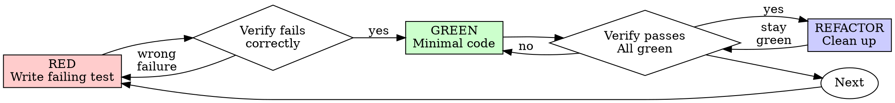

# Test-Driven Development (TDD)

## Overview

Write the test first. Watch it fail. Write minimal code to pass.

**Core principle:** If you didn't watch the test fail, you don't know if it tests the right thing.

**Violating the letter of the rules is violating the spirit of the rules.**

## When to Use

**Always:**
- New features
- Bug fixes
- Refactoring
- Behavior changes

**Exceptions (ask your human partner):**
- Throwaway prototypes
- Generated code
- Configuration files

Thinking "skip TDD just this once"? Stop. That's rationalization.

## The Iron Law

```
NO PRODUCTION CODE WITHOUT A FAILING TEST FIRST
```

Write code before the test? Delete it. Start over.

**No exceptions:**
- Don't keep it as "reference"
- Don't "adapt" it while writing tests
- Don't look at it
- Delete means delete

Implement fresh from tests. Period.

## Red-Green-Refactor



### RED - Write Failing Test

Write one minimal test showing what should happen.

<Good>
```typescript
test('retries failed operations 3 times', async () => {
  let attempts = 0;
  const operation = () => {
    attempts++;
    if (attempts < 3) throw new Error('fail');
    return 'success';
  };

  const result = await retryOperation(operation);

  expect(result).toBe('success');
  expect(attempts).toBe(3);
});
```
Clear name, tests real behavior, one thing
</Good>

<Bad>
```typescript
test('retry works', async () => {
  const mock = jest.fn()
    .mockRejectedValueOnce(new Error())
    .mockRejectedValueOnce(new Error())
    .mockResolvedValueOnce('success');
  await retryOperation(mock);
  expect(mock).toHaveBeenCalledTimes(3);
});
```
Vague name, tests mock not code
</Bad>

**Requirements:**
- One behavior
- Clear name
- Real code (no mocks unless unavoidable)

### Verify RED - Watch It Fail

**MANDATORY. Never skip.**

```bash
npm test path/to/test.test.ts
```

Confirm:
- Test fails (not errors)
- Failure message is expected
- Fails because feature missing (not typos)

**Test passes?** You're testing existing behavior. Fix test.

**Test errors?** Fix error, re-run until it fails correctly.

### GREEN - Minimal Code

Write simplest code to pass the test.

<Good>
```typescript
async function retryOperation<T>(fn: () => Promise<T>): Promise<T> {
  for (let i = 0; i < 3; i++) {
    try {
      return await fn();
    } catch (e) {
      if (i === 2) throw e;
    }
  }
  throw new Error('unreachable');
}
```
Just enough to pass
</Good>

<Bad>
```typescript
async function retryOperation<T>(
  fn: () => Promise<T>,
  options?: {
    maxRetries?: number;
    backoff?: 'linear' | 'exponential';
    onRetry?: (attempt: number) => void;
  }
): Promise<T> {
  // YAGNI
}
```
Over-engineered
</Bad>

Don't add features, refactor other code, or "improve" beyond the test.

### Verify GREEN - Watch It Pass

**MANDATORY.**

```bash
npm test path/to/test.test.ts
```

Confirm:
- Test passes
- Other tests still pass
- Output pristine (no errors, warnings)

**Test fails?** Fix code, not test.

**Other tests fail?** Fix now.

**"Other tests" means the project's suite, not just your file.** A
green run of the test you wrote is not a green suite. Before you call
the change done, run the project's test command (bare `pytest`,
`npm test`, `cargo test` — whatever the repo uses) even when your task
named only one test file. A scope statement in your task bounds the
deliverable, not your verification. Any failure that run shows —
including one you didn't cause — goes in your report by name; a red
test you watched scroll past and didn't mention is a report falsified
by omission.

### REFACTOR - Clean Up

After green only:
- Remove duplication
- Improve names
- Extract helpers

Keep tests green. Don't add behavior.

### Repeat

Next failing test for next feature.

## Good Tests

| Quality | Good | Bad |
|---------|------|-----|
| **Minimal** | One thing. "and" in name? Split it. | `test('validates email and domain and whitespace')` |
| **Clear** | Name describes behavior | `test('test1')` |
| **Shows intent** | Demonstrates desired API | Obscures what code should do |

When writing or changing any test, read [writing-good-tests.md](writing-good-tests.md) for the rules that keep tests honest:
- Name the production change that would make the test fail — before writing it
- Assert on real behavior, never on mock behavior
- Keep test-only code in test utilities, out of production classes
- Understand a dependency's side effects before mocking it

## 时段敏感断言：禁止写死绝对时长，必须与边界函数对齐

待测行为带「向未来某个时间边界兜底」的语义时（日额度重置、次日 00:00 冷却、到期时间…），
最容易写出**按运行时刻假红**的断言：

```python
# ✗ 坏：写死「剩余 > 1 小时」
assert entry["resetAtMs"] - int(time.time() * 1000) > 3600 * 1000
```

这条用例在白天跑是绿的，23:00 之后跑**必然假红**——因为兜底终点是次日 00:00，此刻距它天然不足 1 小时。
自查时极易把它当成真回归，浪费一轮。

**两条正确写法**（同一行为，两个互补的判据）：

1. **与边界函数对齐**：调被测代码自己用的边界函数，比对剩余量是否一致；

```python
expect_ms, _ = module._next_day_reset_ms(module._DAILY_QUOTA_FALLBACK_HOUR)
remaining = (entry["resetAtMs"] - time.time() * 1000) / 1000.0
expect = (expect_ms - time.time() * 1000) / 1000.0
assert abs(remaining - expect) < 5, f"应对齐日边界: 实得 {remaining}s 期望 {expect}s"
```

2. **排除错误区间（而非断言正确区间）**：断言「**不落在**瞬时软窗内」比「大于某阈值」稳得多。

```python
assert effective > 400, "不得落入 255~345s 的瞬时软窗"   # 排除错误，不猜正确
```

**同时注意字段口径**：真正卡住调用方的往往是**生效字段**，而不是给 UI 展示的那个
（实测：用例查了展示字段 `resetAtMs`，真正闸门是 `monotonic_until`——展示字段对了、行为仍可能是错的）。
两个都要断言，并加一条「两者同源」。

### 根治手法：冻结时钟，并要求「量剩余量」与实现同源

「与边界函数对齐」和「排除错误区间」都只是**缓解**——只要还在读真实墙钟，午夜附近就仍有
盲区（实测：对齐写法在 23:54 跑出 350s，`>400` 的排除写法照样假红）。根治是把时钟钉死：

```python
class _FrozenDateTime(datetime.datetime):
    @classmethod
    def now(cls, tz=None):          # ⚠️ 必须**显式覆盖**：
        fixed = cls._fixed          #   继承只是拿到同一个 classmethod，照样读真实时钟
        return fixed.astimezone(tz) if tz else fixed.replace(tzinfo=None)
```

**三个必踩的坑，每个都要有自检用例（否则冻结失效了你不会知道）**：

| 坑 | 症状 | 判据 |
|---|---|---|
| 只继承、没覆盖 `now` | 冻结看似生效，其实读真实时钟 | 断言 `模块.datetime.datetime.now(tz)` 等于钉死时刻 |
| **只冻结 `datetime`、不冻结 `time`** | 日边界是**绝对时刻**；只挪「现在」时，剩余量仍按真实墙钟算 → 依旧假红 | 断言 `模块.time.time()` 与冻结的 `now().timestamp()` 差 < 1s |
| **量剩余量用了测试自己的 `time`** | 实现用冻结时钟、用例用真实时钟 → 剩余量算出负数、差值上万秒 | 量剩余量一律写 `模块.time.monotonic()`（经被测模块取值，与实现同源） |

「与实现同源」这条即使**没有**冻结时钟也必须遵守：它保证用例与实现看到的是同一个时钟，
是量剩余量的唯一可靠写法。

## 变异验证 harness：源文件是 CRLF 时锚点会静默不匹配

验证「测试真的能抓住 bug」的标准手法是把实现改坏、跑测试、期待变红。
**Windows 上这步会静默失效**：用 `newline=""` 读入 CRLF 源文件后，用 `\n` 写的多行锚点
永远匹配不上，于是变异未生效；而脚本若只打印「未变红」而不区分原因，就会被误读为
「用例强度不够」，跑去强化本来没问题的用例。

```python
raw = io.open(P, encoding="utf-8", newline="").read()
CRLF = "\r\n" in raw
orig = raw.replace("\r\n", "\n") if CRLF else raw   # 归一后再匹配
# 写回时还原：s.replace("\n", "\r\n") if CRLF else s
io.open(P, "w", encoding="utf-8", newline="").write(out)
```

且 harness 必须**区分三种结局**，并把锚点未匹配单独报错，不能和「未变红」混为一谈：

| 结局 | 含义 |
|---|---|
| `变异未生效（anchor 没匹配）` | harness 自身问题，用例强度未受检验——先修行尾/锚点 |
| 有 `FAILED` | 用例抓住了该变异 ✓ |
| `⚠ 未变红` | 用例强度不足，需强化断言 |

**变异必须打在全部同类落点上。** 同一修复若铺在 N 处（如 5 个端点各一行），只变异其中
2 处会**漏判**：命中的用例可能恰好只走另外 3 处的路径。实测：一个覆盖 5 处的记账修复，
变异只改流式那 2 处 → 报「未变红」，看起来像用例太弱，其实是变异打偏了。做法是把锚点写成
**不带实例差异的公共子串**（如 `_mark(..., uid=` 而非含 `curr_uid` 的整行），一次命中全部落点；
harness 报出 anchor 命中次数，便于确认覆盖面。

### 「批量变异全红」≠「每处都不会静默回归」

上面那条只解决「变异打偏」，**本质问题是覆盖拓扑**：一次把 N 处全改掉当然会红，
但那证明不了「单独拔掉第 k 处也会红」。实测一份 5 落点修复：批量变异 5/5 全绿，
逐点抹除却只有 **1/5** 能被抓 —— 其余 4 处可以单点回归而整套用例照绿。

**N 处独立落点 = N 条直接契约，这是最低闭环。** 判据不是「数个数」，而是逐个定向变异：
每处单独抹掉（把该行换成 `pass`），对应断言必须变红。harness 三条纪律：

1. **先 `ast.parse` 校验变异体**。删掉一行常留下空块 → `SyntaxError` → pytest 非零退出，
   会被误当成「已抓红」（实测就这样报过一个假的 5/5）。
2. **区分三种结局**：断言失败（真抓到）/ 测试自身报错（结论无效）/ 全绿（覆盖缺口）。
3. **收尾还原并校验**（比对还原后文本与原文相等），别把变异留在源码里。

按行号定位比按文本锚点稳（每处调用独占一行，缩进各异），但 `ast.parse` 与还原校验照旧要做。

### 补契约时最容易造出「名字写着覆盖、实际走另一条路」的假用例

为本条落点写测试时，**必须先确认请求真的会走那条分支**。实测两个典型陷阱：
- **缺省值把请求带去另一条路**：`/v1/responses` 的开关是 `raw_body.get("stream", True)`，
  缺省即流式；「非流式用例」没写 `stream` 就落到了流式落点上，目标落点从未被覆盖。
- **需要前置条件才进入该分支**：某条流式路径的进入条件是
  `client_wants_stream and has_tools and repair_stream_tools`，不带 `tools` 就走到另一条落点。

发现手段就是上面的逐点变异（它会把假覆盖直接暴露成「未变红」）。

另：单行锚点同样受行尾影响（行首缩进 + 行尾 `\r`），归一化是唯一可靠做法。

## Common Rationalizations

| Excuse | Reality |
|--------|---------|
| "Too simple to test" | Simple code breaks. Test takes 30 seconds. |
| "I'll test after" | Tests written after pass immediately — which proves nothing. They may test the wrong thing, test the implementation instead of the behavior, or miss the edge case you forgot. You never watched it fail, so you never proved it can catch the bug. Test-first forces that failure. |
| "Tests after achieve same goals (spirit not ritual)" | Tests-after answer "what does this do?"; tests-first answer "what should this do?" Tests written after are biased by the code you already wrote — you verify the cases you remembered, not the ones you'd have discovered. Coverage without proof the tests work. |
| "Already manually tested" | Manual testing is ad-hoc: no record of what you covered, no way to re-run it when the code changes, easy to forget cases under pressure. "Worked when I tried it" ≠ comprehensive. Automated tests run the same way every time. |
| "Deleting X hours is wasteful" | Sunk cost fallacy — that time is already spent either way. The real choice: rewrite with TDD (high confidence) vs. keep it and bolt tests on after (low confidence, likely bugs). Keeping code you can't trust is the waste. |
| "Keep as reference, write tests first" | You'll adapt it. That's testing after. Delete means delete. |
| "Need to explore first" | Fine. Throw away exploration, start with TDD. |
| "Test hard = design unclear" | Listen to test. Hard to test = hard to use. |
| "TDD will slow me down" | TDD IS the pragmatic path: catches bugs before commit, prevents regressions, lets you refactor without fear. "Pragmatic" shortcuts mean debugging in production — slower, not faster. |
| "Manual test faster" | Manual doesn't prove edge cases. You'll re-test every change. |
| "Existing code has no tests" | You're improving it. Add tests for existing code. |

## Red Flags - STOP and Start Over

- Code before test
- Test after implementation
- Test passes immediately
- Can't explain why test failed
- Tests added "later"
- Rationalizing "just this once"
- "I already manually tested it"
- "Tests after achieve the same purpose"
- "It's about spirit not ritual"
- "Keep as reference" or "adapt existing code"
- "Already spent X hours, deleting is wasteful"
- "TDD is dogmatic, I'm being pragmatic"
- "This is different because..."

**All of these mean: Delete code. Start over with TDD.**

## Example: Bug Fix

**Bug:** Empty email accepted

**RED**
```typescript
test('rejects empty email', async () => {
  const result = await submitForm({ email: '' });
  expect(result.error).toBe('Email required');
});
```

**Verify RED**
```bash
$ npm test
FAIL: expected 'Email required', got undefined
```

**GREEN**
```typescript
function submitForm(data: FormData) {
  if (!data.email?.trim()) {
    return { error: 'Email required' };
  }
  // ...
}
```

**Verify GREEN**
```bash
$ npm test
PASS
```

**REFACTOR**
Extract validation for multiple fields if needed.

## Verification Checklist

Before marking work complete:

- [ ] Every new function/method has a test
- [ ] Watched each test fail before implementing
- [ ] Each test failed for expected reason (feature missing, not typo)
- [ ] Wrote minimal code to pass each test
- [ ] All tests pass
- [ ] Output pristine (no errors, warnings)
- [ ] Tests use real code (mocks only if unavoidable)
- [ ] Edge cases and errors covered

Can't check all boxes? You skipped TDD. Start over.

## When Stuck

| Problem | Solution |
|---------|----------|
| Don't know how to test | Write wished-for API. Write assertion first. Ask your human partner. |
| Test too complicated | Design too complicated. Simplify interface. |
| Must mock everything | Code too coupled. Use dependency injection. |
| Test setup huge | Extract helpers. Still complex? Simplify design. |

## Debugging Integration

Bug found? Write failing test reproducing it. Follow TDD cycle. Test proves fix and prevents regression.

Never fix bugs without a test.

## Final Rule

```
Production code → test exists and failed first
Otherwise → not TDD
```

No exceptions without your human partner's permission.
